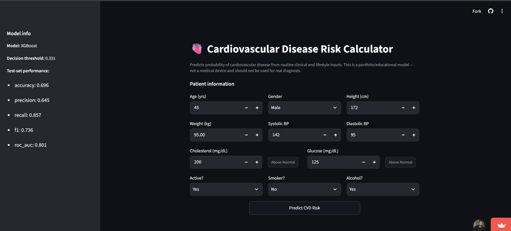
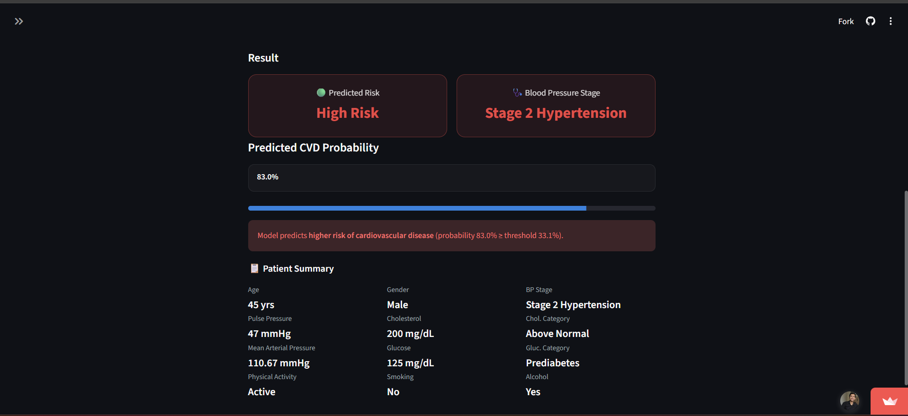
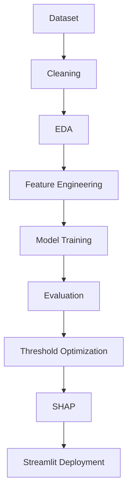
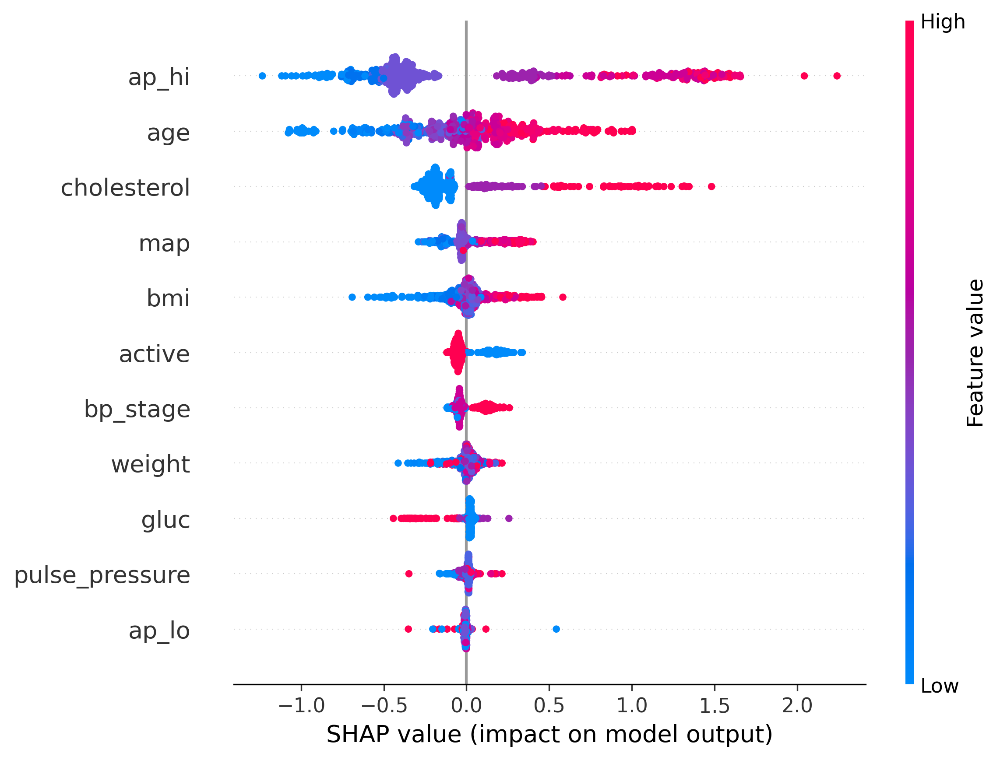
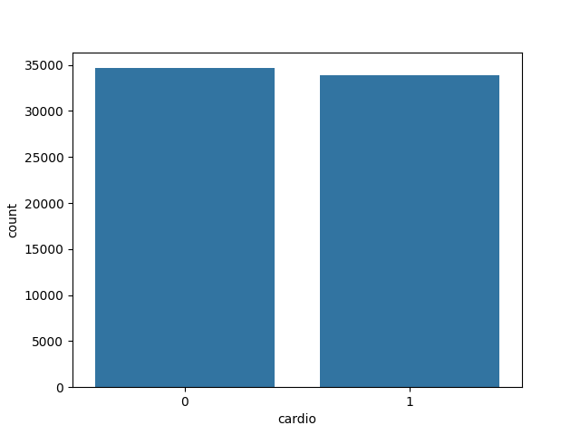
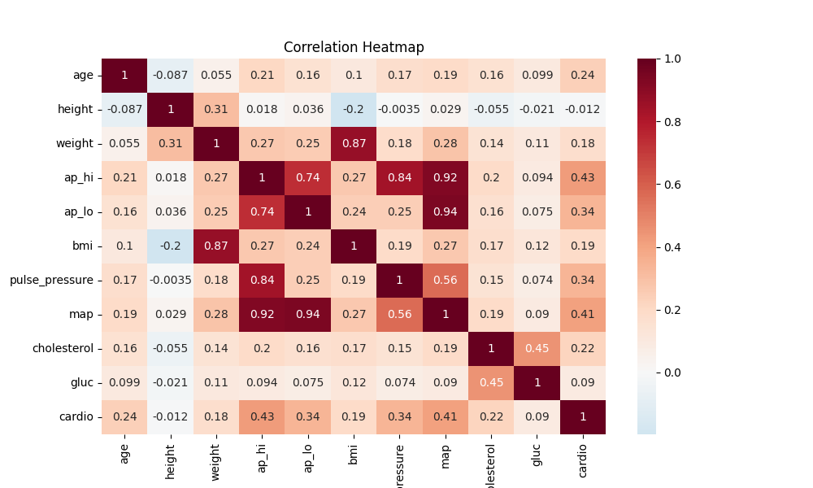
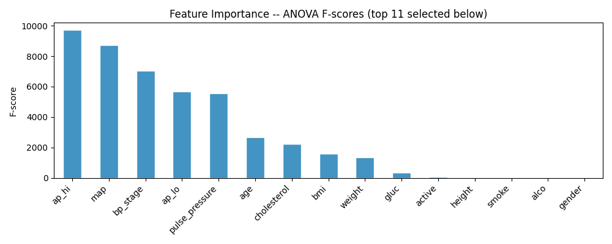
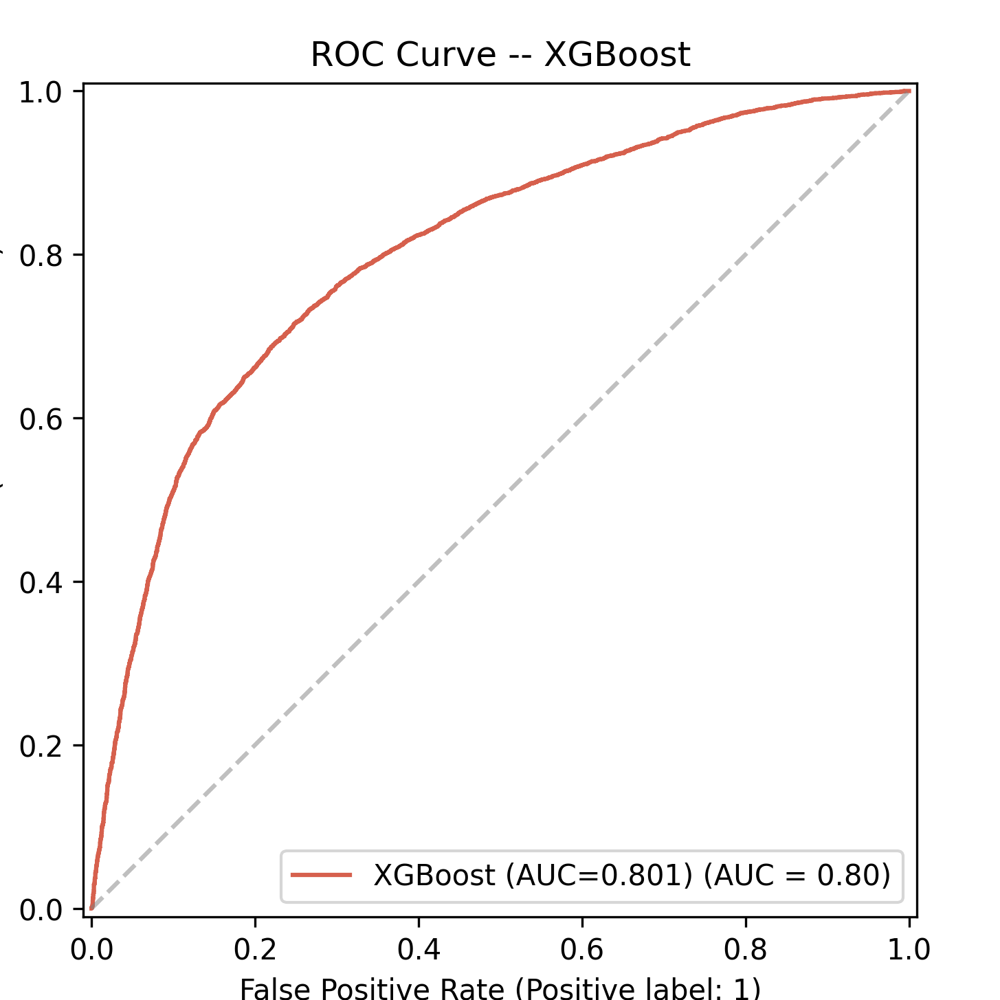
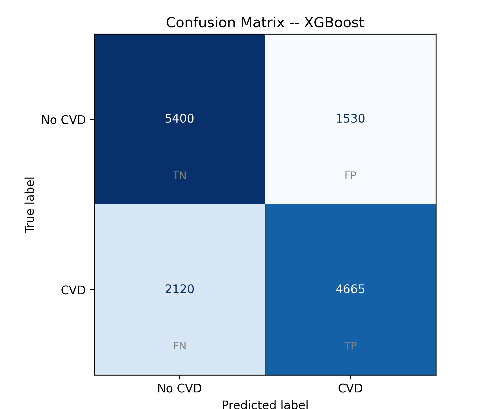
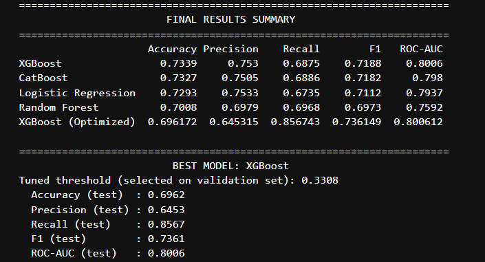

# 🫀 Cardiovascular Disease Risk Prediction using Machine Learning
    

An end-to-end machine learning project for predicting the risk of cardiovascular disease using clinical patient data. This project covers data preprocessing, feature engineering, model training, evaluation, and explainable AI using SHAP.

---
## 🚀 Live Demo

**Streamlit App:** https://smart-cvd-predictor.streamlit.app

## Application Preview





---
# Project Overview

Cardiovascular disease (CVD) is one of the leading causes of death worldwide, making early prediction an important healthcare problem. The goal of this project is to build and compare different machine learning models that can predict whether a patient is likely to have cardiovascular disease based on medical and lifestyle-related information.

Instead of training a single model, I explored the complete machine learning workflow—from cleaning the data and engineering meaningful features to comparing multiple classification algorithms and explaining their predictions.

During this project, I experimented with different preprocessing techniques, feature selection methods, and machine learning models to understand how each step affects the final performance. I also used SHAP (SHapley Additive exPlanations) to interpret the predictions made by the best-performing model.

The project demonstrates the complete machine learning workflow, including:

* Data preprocessing and cleaning
* Exploratory Data Analysis (EDA)
* Feature engineering
* Feature selection
* Classification algorithms
* Model evaluation
* Cross-validation
* Threshold optimization
* Explainable AI using SHAP

---

# Problem Statement

Given a patient's medical information such as age, gender, blood pressure, cholesterol level, glucose level, body measurements, smoking habits, alcohol consumption, and physical activity, the objective is to predict whether the patient is likely to have cardiovascular disease.

This is a **binary classification** problem where:

* **0** → No Cardiovascular Disease
* **1** → Cardiovascular Disease

---

# Features

## Data Processing

* Data cleaning
* Duplicate removal
* Outlier detection
* Feature scaling
* Data visualization

## Feature Engineering

* Body Mass Index (BMI)
* Pulse Pressure
* Mean Arterial Pressure (MAP)
* Age conversion from days to years

## Machine Learning Models

* Logistic Regression
* Random Forest
* XGBoost
* CatBoost

## Model Evaluation

* Accuracy
* Precision
* Recall
* F1 Score
* ROC-AUC Score
* Confusion Matrix
* ROC Curve
* Cross Validation

## Explainable AI

* SHAP Summary Plot
* Feature Importance
* Model Interpretation

---

# Repository Structure

```text
Cardiovascular-Disease-Risk-Prediction/
│
├── data/
│   └── cardio_train.csv
│
├── notebooks/
│   └── CVD.ipynb                     
│
├── models/
│   └── cvd_model_bundle.joblib 
│
├── images/
│   ├── streamlit_dashboard.png
│   ├── streamlit_prediction.png
│   ├── class_distribution.png
│   ├── correlation_heatmap.png
│   ├── confusion_matrix.png
│   ├── feature_importance.png
│   ├── model_comparison.png
│   ├── roc_curve.png
│   ├── shap_summary.png
│   ├── shap_waterfall.png
│   └── threshold_optimization.png
│
├── app.py                         
│
├── requirements.txt
├── README.md
├── LICENSE
└──  .gitignore
```

---

# Installation

Clone the repository

```bash
git clone https://github.com/saklaniabhimanyu/Cardiovascular-Disease-Risk-Prediction.git
```

Move to the project directory

```bash
cd Cardiovascular-Disease-Risk-Prediction
```

Install the required libraries

```bash
pip install -r requirements.txt
```

Launch Jupyter Notebook

```bash
jupyter notebook
```

Open

```text
notebook/CVD.ipynb
```

and run all the cells to reproduce the complete workflow.

## Quick Start

```bash
git clone https://github.com/saklaniabhimanyu/Cardiovascular-Disease-Risk-Prediction.git

cd Cardiovascular-Disease-Risk-Prediction

pip install -r requirements.txt

streamlit run app.py
```
## Deployment

The trained XGBoost model was packaged using Joblib and deployed as an interactive Streamlit web application that predicts cardiovascular disease risk from patient information.

# Machine Learning Workflow

The workflow followed in this project is shown below:




Each stage was performed sequentially to build an interpretable and reliable machine learning model.

---

# Data Preprocessing

Before training the models, the dataset was cleaned and prepared to improve model performance.

The preprocessing steps included:

* Checking the dataset structure and data types
* Removing duplicate records
* Handling unrealistic values
* Detecting and treating outliers
* Converting age from days to years
* Splitting blood pressure into meaningful features
* Scaling numerical features where required
* Creating training and testing datasets

Cleaning the dataset before model training helped reduce noise and improved the quality of the predictions.

---

# Exploratory Data Analysis (EDA)

Exploratory Data Analysis was performed to better understand the dataset before building machine learning models.

Some of the analyses include:

* Distribution of cardiovascular disease classes
* Age distribution
* Blood pressure distribution
* Cholesterol levels
* Glucose levels
* Correlation heatmap
* Feature relationships

EDA helped identify patterns, possible outliers, and important variables that influence cardiovascular disease.

---

# Feature Engineering

Instead of using only the original dataset features, I created additional features that provide more meaningful medical information.

### Body Mass Index (BMI)

BMI was calculated using height and weight.

BMI is a commonly used health indicator that estimates whether a person's weight is appropriate for their height.

---

### Pulse Pressure

Pulse Pressure is calculated as

```
Pulse Pressure = Systolic BP − Diastolic BP
```

It represents the difference between systolic and diastolic blood pressure and is often associated with cardiovascular health.

---

### Mean Arterial Pressure (MAP)

Mean Arterial Pressure was calculated using

```
MAP = Diastolic BP + (Pulse Pressure / 3)
```

MAP estimates the average blood pressure during one complete cardiac cycle.

---

### Age Conversion

The original dataset stores age in days.

For better interpretability, age was converted into years before model training.

---

# Feature Selection

After creating additional features, feature selection was performed to identify the most informative variables.

Removing less useful features helped reduce noise and simplified the learning process while maintaining predictive performance.

---

# Models Implemented

To compare different approaches, multiple machine learning algorithms were trained on the same dataset.

## Logistic Regression

Logistic Regression serves as a simple and interpretable baseline model for binary classification.

Advantages

* Easy to interpret
* Fast training
* Strong baseline performance

---

## Random Forest

Random Forest combines multiple decision trees to improve prediction accuracy and reduce overfitting.

Advantages

* Handles non-linear relationships
* Less sensitive to noise
* Provides feature importance

---

## XGBoost

XGBoost is a gradient boosting algorithm that builds trees sequentially by correcting the errors made by previous trees.

Advantages

* High predictive performance
* Handles complex feature interactions
* Built-in regularization
* Efficient training

---

## CatBoost

CatBoost is another gradient boosting algorithm designed to reduce prediction bias and improve generalization.

Advantages

* Excellent performance on structured datasets
* Requires minimal preprocessing
* Strong handling of categorical information

---

# Model Evaluation

Each model was evaluated using multiple classification metrics instead of relying only on accuracy.

The evaluation metrics include:

* Accuracy
* Precision
* Recall
* F1 Score
* ROC-AUC Score

Using multiple metrics provides a better understanding of model performance, especially for healthcare datasets where minimizing false predictions is important.

---

# Dataset

The project uses the **Cardiovascular Disease Dataset** available on Kaggle.

**Dataset:** [Cardiovascular Disease Dataset (Kaggle)](https://www.kaggle.com/datasets/sulianova/cardiovascular-disease-dataset)

The dataset contains **70,000 patient records** with demographic, clinical, and lifestyle-related information. The objective is to predict whether a patient has cardiovascular disease based on these features. The dataset includes 13 input attributes and 1 target variable. 

## Dataset Features

| Feature     | Description                                   |
| ----------- | --------------------------------------------- |
| id          | Patient ID                                    |
| age         | Age (in days)                                 |
| gender      | Gender (1 = Female, 2 = Male)                 |
| height      | Height (cm)                                   |
| weight      | Weight (kg)                                   |
| ap_hi       | Systolic Blood Pressure                       |
| ap_lo       | Diastolic Blood Pressure                      |
| cholesterol | Cholesterol Level (1–3)                       |
| gluc        | Glucose Level (1–3)                           |
| smoke       | Smoking Status                                |
| alco        | Alcohol Consumption                           |
| active      | Physical Activity                             |
| cardio      | Target Variable (0 = No Disease, 1 = Disease) |

### Target Variable

The prediction task is a binary classification problem:

* **0** → No Cardiovascular Disease
* **1** → Cardiovascular Disease

### Dataset Statistics

* **Total Samples:** 70,000
* **Input Features:** 13
* **Target Classes:** 2
* **Task:** Binary Classification

---

> **Note:** During preprocessing, additional features such as **BMI**, **Pulse Pressure**, and **Mean Arterial Pressure (MAP)** were engineered from the original dataset to improve model performance.

---

```
notebook/CVD.ipynb
```

and run all the cells to reproduce the complete workflow.

---

# Model Comparison

Different machine learning models were trained and evaluated on the same training and testing datasets. Instead of selecting a model based only on accuracy, I compared them using multiple evaluation metrics, including Precision, Recall, F1 Score, ROC-AUC, and 10-fold Cross Validation.

| Model               |   Accuracy |  Precision |     Recall |   F1 Score |    ROC-AUC |  CV F1 (Mean ± Std) |
| ------------------- | ---------: | ---------: | ---------: | ---------: | ---------: | ------------------: |
| **XGBoost**         | **0.7339** | **0.7530** | **0.6875** | **0.7188** | **0.8006** | **0.7191 ± 0.0103** |
| CatBoost            |     0.7327 |     0.7505 |     0.6886 |     0.7182 |     0.7980 |     0.7190 ± 0.0095 |
| Logistic Regression |     0.7293 |     0.7533 |     0.6735 |     0.7112 |     0.7937 |     0.7091 ± 0.0099 |
| Random Forest       |     0.7008 |     0.6979 |     0.6968 |     0.6973 |     0.7592 |     0.6958 ± 0.0079 |

---

# Results

After comparing all four models, **XGBoost** achieved the best overall performance on this dataset. It provided the highest ROC-AUC score while maintaining a good balance between precision and recall.

To improve the model's ability to detect positive cardiovascular disease cases, the default classification threshold was optimized using the validation set.

### Best Model: XGBoost

| Metric              |      Value |
| ------------------- | ---------: |
| Optimized Threshold | **0.3308** |
| Precision           | **0.6453** |
| Recall              | **0.8567** |
| F1 Score            | **0.7361** |
| ROC-AUC             | **0.8006** |


A lower decision threshold increased the model's recall, allowing it to identify more patients with cardiovascular disease. Although precision decreased slightly, the overall F1 Score improved, making the model more suitable for a healthcare application where missing positive cases can be more critical than generating additional false positives.

### Key Observations

* XGBoost achieved the highest overall performance among all the evaluated models.
* CatBoost produced results very close to XGBoost and showed stable performance across cross-validation folds.
* Logistic Regression served as a strong baseline despite being a much simpler model.
* Random Forest achieved reasonable performance but was outperformed by the boosting-based models.
* Feature engineering improved the predictive capability of the models by introducing clinically meaningful variables such as BMI, Pulse Pressure, and Mean Arterial Pressure.
* SHAP analysis helped explain the model's predictions by highlighting the features that contributed most to cardiovascular disease risk.

Overall, this project demonstrated how careful preprocessing, feature engineering, model comparison, and threshold optimization can improve the performance and interpretability of a machine learning model for cardiovascular disease prediction.

---

# Explainable AI (SHAP)

To better understand how the best-performing model makes predictions, SHAP (SHapley Additive exPlanations) was used.

SHAP assigns an importance value to each feature based on its contribution to the model's prediction.

Some benefits of using SHAP include:

* Understanding feature importance
* Explaining individual predictions
* Improving model transparency
* Increasing trust in the model's decisions

Example SHAP Summary Plot

```text
images/shap_summary.png
```



---

# Visualizations

## The project includes several visualizations to explore the dataset, evaluate model performance, and interpret the predictions made by the best-performing machine learning model.
---

## Class Distribution

This visualization shows the distribution of patients with and without cardiovascular disease. Examining the class balance helps determine whether the dataset is balanced before training machine learning models.



---


## Correlation Heatmap

The correlation heatmap illustrates the relationships between numerical features in the dataset. It helps identify highly correlated variables and provides insights into how different clinical measurements are associated with each other.



---

## Feature Importance

This visualization ranks the most influential features learned by the XGBoost model. It highlights which patient characteristics contribute the most to cardiovascular disease prediction.



---

## ROC Curve

The Receiver Operating Characteristic (ROC) curve evaluates the classification performance of each model across different decision thresholds. A higher Area Under the Curve (ROC-AUC) indicates better discrimination between positive and negative classes.



---

## Confusion Matrix

The confusion matrix summarizes the prediction results by showing the number of true positives, true negatives, false positives, and false negatives. It provides a detailed understanding of the model's classification performance.


---
## Model Comparison

This figure compares the performance of all evaluated machine learning models using multiple evaluation metrics. It provides an overall comparison of Logistic Regression, Random Forest, CatBoost, and XGBoost.



---

## SHAP Summary Plot

The SHAP (SHapley Additive exPlanations) summary plot explains how each feature contributes to the model's predictions. It improves model interpretability by showing both the importance and direction of each feature's impact.


---

# Example Usage

```python
import joblib

bundle = joblib.load("models/cvd_model_bundle.joblib")

model = bundle["model"]

prediction = model.predict(X_new)
```

---

# Future Improvements

Some ideas for extending this project further:

* Perform model calibration
* Experiment with deep learning models
* Validate the model on external datasets

---

# Technologies Used

* Python
* NumPy
* Pandas
* Matplotlib
* Seaborn
* Scikit-learn
* XGBoost
* CatBoost
* SHAP
* Jupyter Notebook
* Streamlit
* Joblib

---

# Acknowledgements

- Thanks to the creators of the Cardiovascular Disease Dataset for making it publicly available.
- Thanks to the open-source Python community and the developers of Scikit-learn, XGBoost, CatBoost, and SHAP.
---

# Author

**Abhimanyu Saklani**

If you found this project useful or have suggestions for improvement, feel free to open an issue or connect with me.

GitHub: https://github.com/saklaniabhimanyu

⭐ If you like this project, consider giving it a star!
